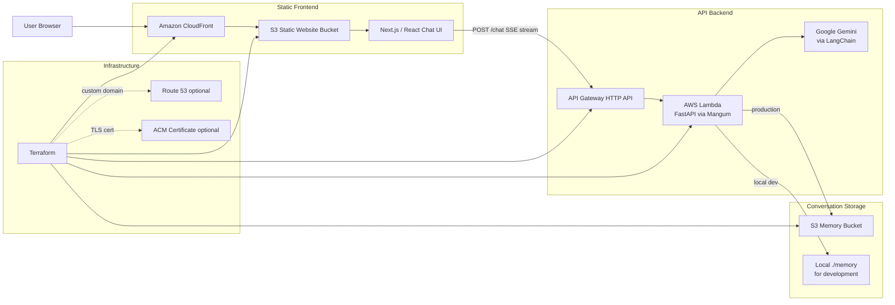

# Digital Twin

An AI-powered digital twin web app that answers questions about Tanmay's professional background, projects, and experience. The app is built as a static Next.js frontend backed by a FastAPI chat API and deploys to AWS with Terraform.

## Architecture



## Tech Stack

- **Frontend:** Next.js 15, React 19, TypeScript, Tailwind CSS
- **Backend:** Python, FastAPI, LangChain Google GenAI, Server-Sent Events streaming
- **Storage:** local JSON files in development, S3 in AWS
- **Infrastructure:** Terraform, AWS Lambda, API Gateway, S3, CloudFront, optional Route 53/ACM
- **Tooling:** mise, uv, bun

## Repository Layout

```text
backend/      FastAPI app, Lambda handler, deployment packaging, twin context data
frontend/     Next.js static export chat UI
terraform/    AWS infrastructure as code
scripts/      Deployment helper script
memory/       Local conversation memory, ignored by Git
```

## Local Development

### Backend

```bash
cd backend
uv sync
export GOOGLE_API_KEY="your_google_api_key"
export CORS_ORIGINS="http://localhost:3000"
uv run uvicorn server:app --reload --port 8000
```

### Frontend

```bash
cd frontend
bun install
NEXT_PUBLIC_API_URL=http://localhost:8000 bun run dev
```

Open `http://localhost:3000`.

## Configuration

Copy the example files and fill in local values as needed:

```bash
cp .env.example .env
cp terraform/terraform.tfvars.example terraform/terraform.tfvars
```

Do not commit real `.env` or `.tfvars` files.

## Deployment

The preferred deployment flow uses `mise` tasks:

```bash
mise run deploy
```

Useful targeted tasks:

```bash
mise run build-lambda
mise run deploy-backend
mise run deploy-frontend-only
mise run deploy-info
```

See [`README-mise.md`](./README-mise.md) for the full task reference.
